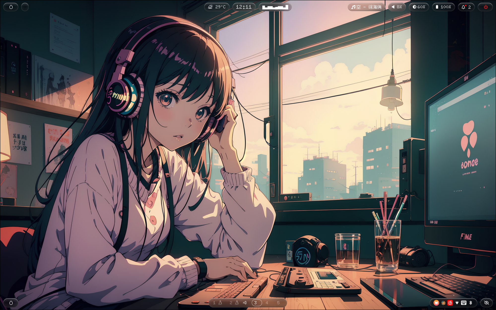
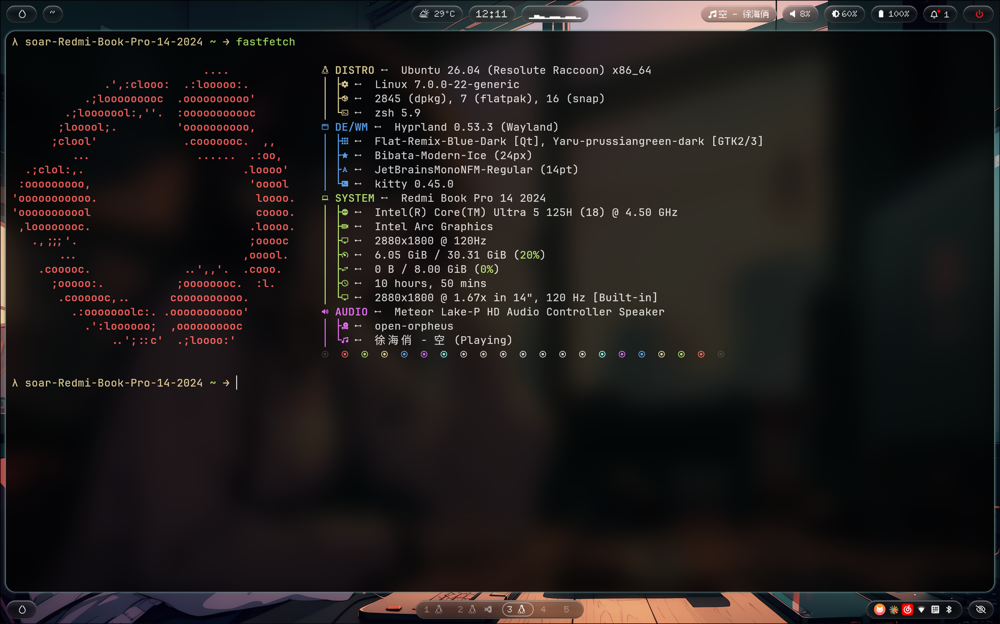

# Nothing Dotfiles

仿 **Nothing Phone** 设计风格的完整 Hyprland 桌面套件 (Waybar + 锁屏 + 通知 + rofi + 电源菜单 + 桌面概览) — 点阵字体 + 毛玻璃 + 黑白单色 + Nothing 红强调 + macOS 式上下分栏布局。为 Hyprland 打造。

> 配套 KooL's Hyprland Dots，也可独立使用。





## ✨ 特性

- **点阵字体** — Google [Doto](https://fonts.google.com/specimen/Doto)（经 Nerd Fonts 打补丁，含全套图标）作英数主字体；中文回退 [Fusion Pixel](https://github.com/TakWolf/fusion-pixel-font) 点阵字。一个字体同时有点阵字形 + 图标，基线对齐。
- **真·毛玻璃** — 模块半透明，由 Hyprland 合成器 `blur` 实时磨砂背景壁纸。
- **黑白单色 + Nothing 红** — 纯白字、半透明黑玻璃岛，仅电源/告警用 Nothing 标志红 `#d71921`。
- **macOS 式布局** — 顶栏=菜单栏（左:菜单/窗口/音乐，右:状态图标+时钟+电源），底栏=Dock（居中工作区）。
- **统一几何** — 全部 16px 药丸圆角、统一模块高度、液态玻璃高光边框。
- **图形化布局编辑器** — 原生 GTK3 拖拽工具（Touch Bar 式），`Super+Shift+B` 打开，拖拽调整模块位置，保存自动重载。

## 📦 依赖

| 必需 | 说明 |
|------|------|
| `waybar` | 状态栏本体 (v0.10+) |
| `hyprland` | 毛玻璃 / 浮动编辑器规则 (0.49+ 用新版 `match:` 语法) |
| `fontconfig` | 字体回退规则 |

| 可选 | 说明 |
|------|------|
| `python-gobject` (GTK3) | 布局编辑器 (Arch: `python-gobject`; Ubuntu: `python3-gi`) |
| `fontforge` | 自行给 Doto 打 Nerd 补丁 (仓库已含打好的 Black) |
| `cava` | 音乐频谱条模块 |

## 🚀 安装

```bash
git clone https://github.com/<你的用户名>/nothing-waybar.git
cd nothing-waybar
./install.sh
```

安装脚本会：
1. 装打包的字体（Doto Black Nerd + Fusion Pixel 简体）并写 fontconfig 规则
2. 拷贝 waybar 模块/布局/样式，软链 `config`、`style.css` 指向本主题（覆盖前自动 `.bak` 备份）
3. 向 `~/.config/hypr/UserConfigs/WindowRules.conf` 注入毛玻璃 + 浮动编辑器规则（带标记块，可被 `uninstall.sh` 移除）
4. 安装布局编辑器

完成后重载：
```bash
killall waybar; nohup waybar >/dev/null 2>&1 &
hyprctl reload   # 应用毛玻璃 / 浮动规则
```

> **毛玻璃前提**：Hyprland 需启用 blur — `decoration { blur { enabled = true } }`。

## 🎨 自定义

| 想改什么 | 改哪里 |
|----------|--------|
| 模块位置 | `Super+Shift+B` 打开布局编辑器拖拽，或直接编辑 `waybar/configs/[Nothing] macOS Style` 的 `modules-left/center/right` |
| 玻璃透明度 | `waybar/style/[Nothing] Dot Matrix.css` 里 `@glass`（值越小越透） |
| 模糊强度 | `hypr/UserDecorations.snippet.conf` 的 `blur { size / passes / vibrancy }` |
| 强调色 | CSS 里 `@accent`（默认 Nothing 红 `#d71921`） |
| 字号 | CSS 全局 `*` 的 `font-size` |

## 🖱 布局编辑器

```bash
python3 ~/.config/waybar/layout-editor/editor.py   # 或 Super+Shift+B
```

- 上方=顶栏/底栏预览（左/中/右三区），下方=模块托盘
- 从托盘拖模块到栏里；栏内方框下的 `‹ ›` 箭头微调顺序；拖回托盘移除
- `Enter` 保存并重载，`Esc` 退出。保存前自动备份 `config.bak`

## ⚠️ 已知坑（血泪经验）

- **`letter-spacing` 必须为 0** — 非 0 会干扰 Pango 渲染图标 PUA 字形，显示成 `...`。
- **中文加粗会糊** — Fusion Pixel 无 bold 字重，`font-weight: bold` 会合成伪粗体糊掉点阵。本主题用 Doto **Black** 真粗字形 + 全局 `font-weight: normal` 解决。
- **cava 频谱条会让全栏 tooltip 失效** — waybar bug。本主题给 cava 模块加了 `"tooltip": false` 规避。
- **tooltip 无法毛玻璃** — Hyprland 0.53 不支持对 layer popup 单独 blur，故 tooltip 用接近不透明背景保证文字清晰。
- **图标字符别手敲** — Nerd Font PUA 码位易敲错/被编辑器吞，改图标用脚本按码位写。

## 🙏 致谢 / 许可

- 配置/脚本/编辑器：MIT（见 [LICENSE](LICENSE)）
- [Doto](https://fonts.google.com/specimen/Doto) · [Fusion Pixel Font](https://github.com/TakWolf/fusion-pixel-font) · [Nerd Fonts](https://github.com/ryanoasis/nerd-fonts) — 均 OFL/MIT，归各自作者
- 基于 [JaKooLit Hyprland-Dots](https://github.com/JaKooLit/Hyprland-Dots) 的 waybar 模块结构
- 设计灵感：[Nothing](https://nothing.tech) Phone / Ndot 字体

---
*Made with 🩷 and a lot of trial-and-error*
